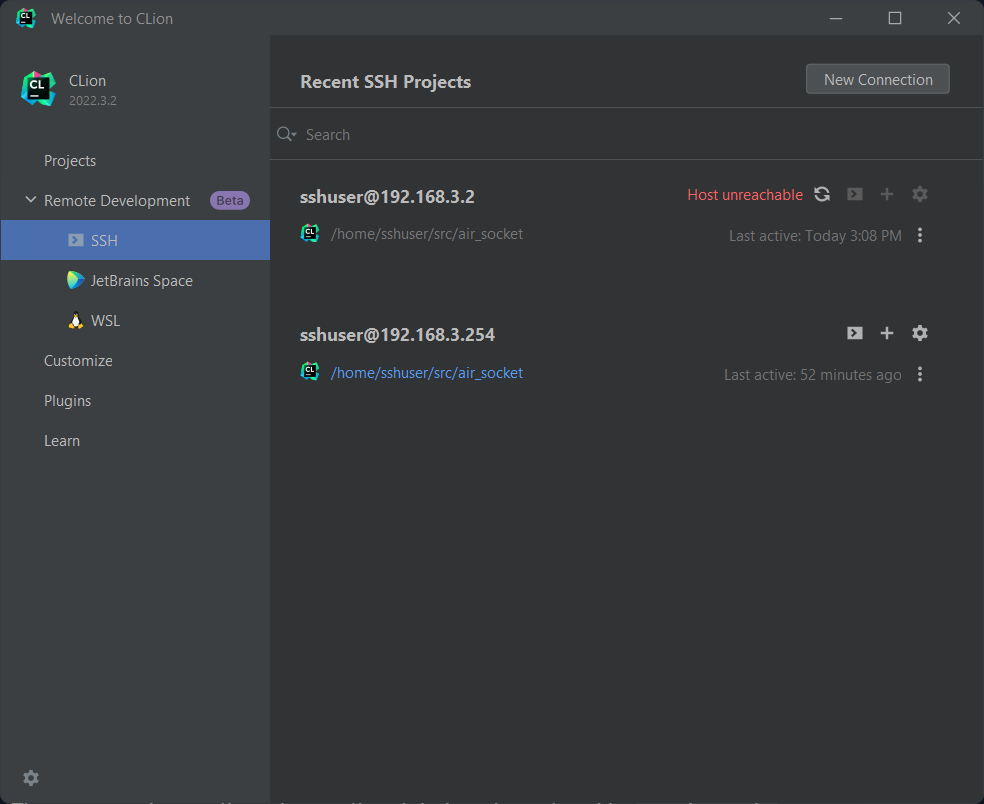
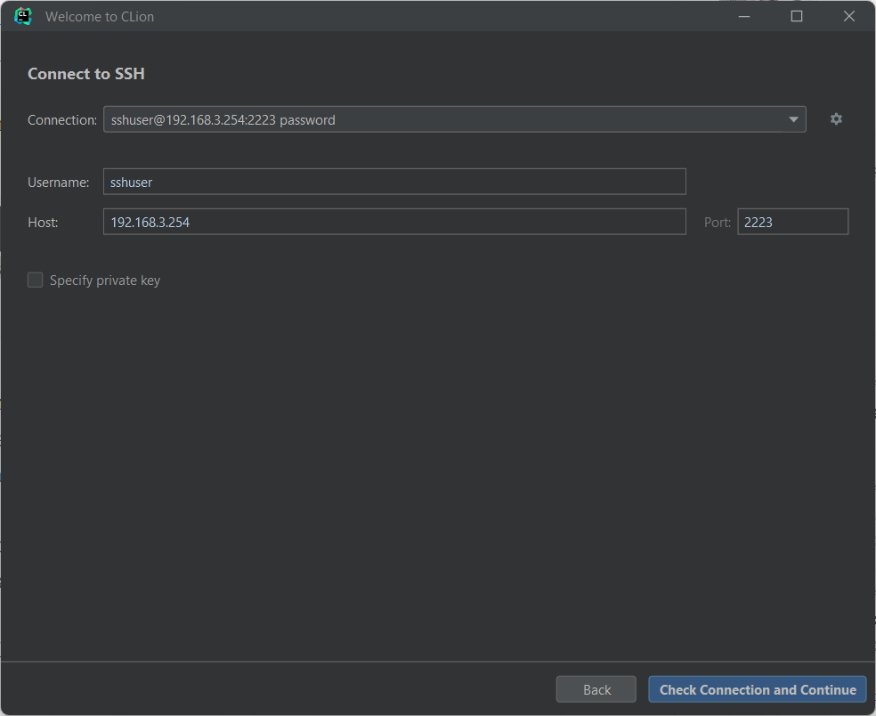
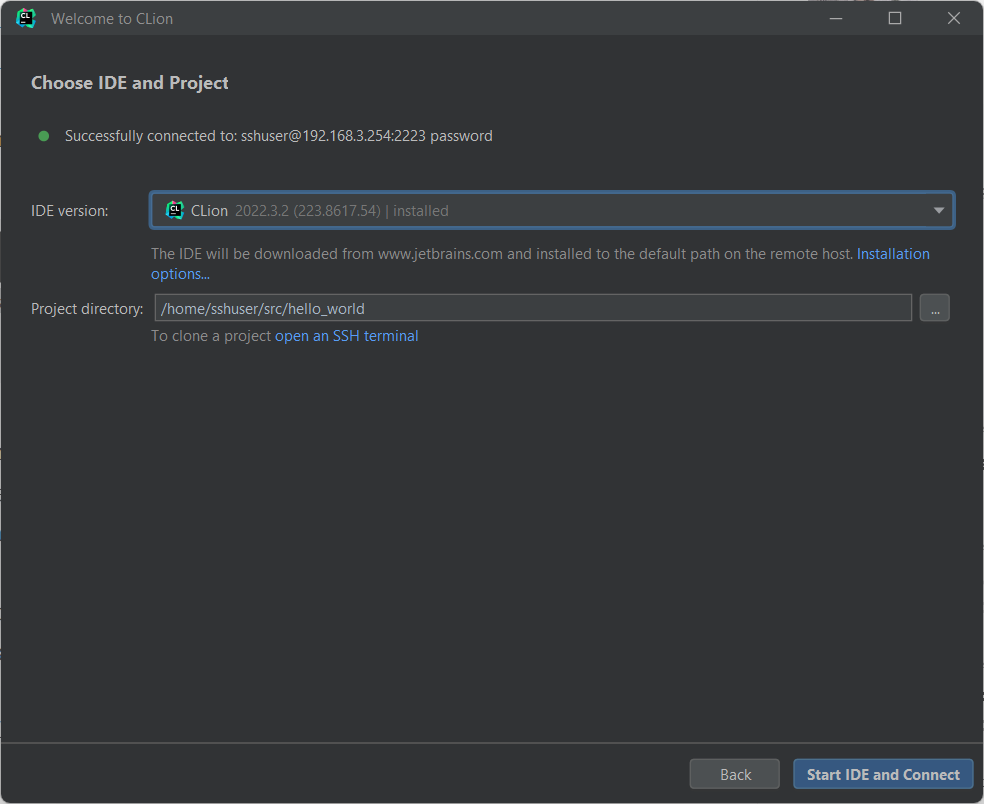
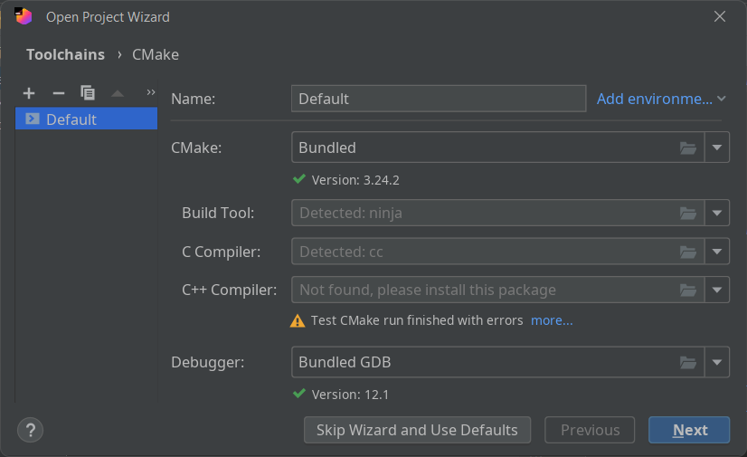
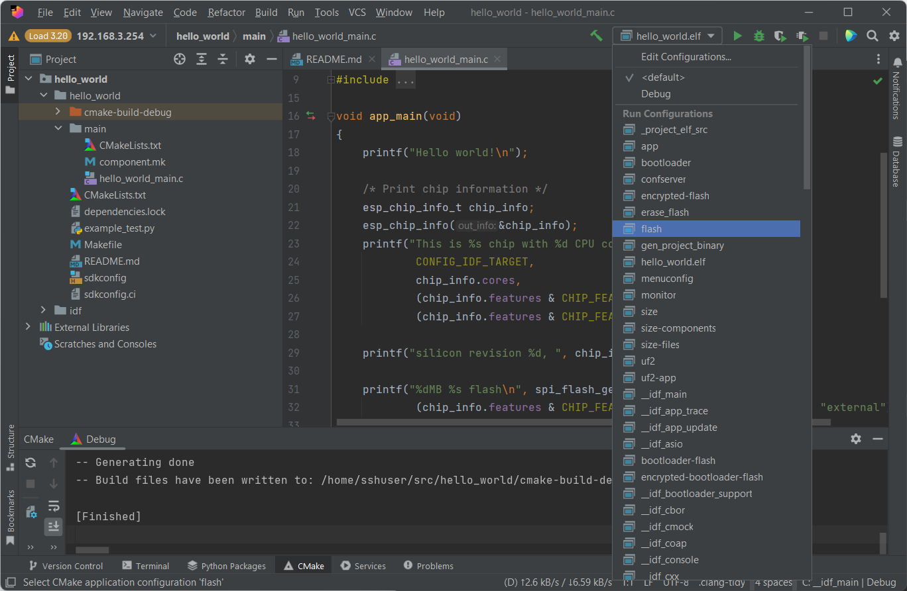

## Development in a Container

It takes some time and effort to configure ESP-IDF and CLion to develop projects for ESP32.
And if you need to switch to another PC or operating system you will need to go through all the configuration steps again.

To solve this it is possible to utilize the Remote Development feature from the CLion IDE and create a Docker image that could have all required software preconfigured.
Even if you are not using CLion you can use such image to build and debug your projects with a command line tools.

For remote development we will use open-ssh server, for building the UI nodejs and esp-idf toolchain for building and flashing ESP32 images.

How to configure ssh in docker is described in [this](https://www.techrepublic.com/article/deploy-docker-container-ssh-access/) article. 
Official Espressif [Dockerfile](https://github.com/espressif/esp-idf/blob/release/v4.4/tools/docker/Dockerfile) could help us to get building environment in Docker. 

So, to start using the docker image you need to build it, run it and connect to it with CLion.

### Build and run Docker image

Prerequisites:
- you have .ssh folder with your keys in the home folder
- your device is attached to the usb port of the host machine
If these conditions are not met just update docker-compose file by your needs before running the image.

1. Clone the repository
   - `git clone git clone git@github.com:devices-fc0-org/esp-dev-ssh.git`
2. build docker image
   - `docker build -t fc0/esp-dev-ssh .` 
3. start container with docker-compose
   - `docker-compose up -d` 

Now you should be able to connect with ssh to your container.
```shell
ssh sshuser@192.168.3.254 -p 2223
``` 
where 192.168.3.254 is your host ip.
Use password `devuserPass`.

Update permissions to mounted volumes (this step should be done only once)
```shell
sudo chown sshuser:sshgroup /home/sshuser/src
sudo chown sshuser:sshgroup /home/sshuser/.ssh
sudo chown sshuser:sshgroup /home/sshuser/.cache
sudo chown sshuser:sshgroup /home/sshuser/.git
sudo chown sshuser:sshgroup /dev//dev/ttyUSB0
```

Configure your git username and email (this step could be skipped if you are not going to push code to your repository)
```shell
git config --global user.name "Your Name"
git config --global user.email "youremail@yourdomain.com"
```

Now you can either clone your project into ~/src folder or copy one of the examples from the esp-idf
```shell
cp -r /opt/esp/idf/examples/get-started/hello_world ~/src
```

### Connect to the Docker image with CLion
1. Run CLion and choose _Remote Development_ -> _SSH_ 

2. Click _New Connection_ and fill in your connection parameters

3. Click the _Check Connection and Continue_ button
4. Then choose IDE version and Project folder. IDE version should be the same version that you are running locally.

5. Click _Start IDE and Connect_
6. In the Open Project Wizard ignore the warning and click _Next_ and then _Finish_

7. If everything went well you should see a \[Finished\] record in the CMake tab.

8. Use Run configurations dropdown to choose the cmake target and a build icon to execute them.


If you don't want to use git to clone the repo you can just copy files from here:

Dockerfile:
```dockerfile
FROM ubuntu:20.04

RUN echo 'APT::Install-Suggests "0";' >> /etc/apt/apt.conf.d/00-docker
RUN echo 'APT::Install-Recommends "0";' >> /etc/apt/apt.conf.d/00-docker

ARG DEBIAN_FRONTEND=noninteractive
ENV TZ=Etc/UTC
RUN apt-get update \
  && apt-get install -y locales \
    openssh-server \
    sudo \
    nano \
    iputils-ping \
    curl \
    wget \
    ca-certificates \
    git \
    apt-utils \
    bison \
    ccache \
    check \
    flex \
    git-lfs \
    gperf \
    lcov \
    libffi-dev \
    libncurses-dev \
    libpython2.7 \
    libusb-1.0-0-dev \
    make \
    ninja-build \
    python3 \
    python3-pip \
    unzip \
    xz-utils \
    zip \
    cmake \
    nodejs \
    npm \
    && update-ca-certificates \
  && apt-get autoremove -y \
  && rm -rf /var/lib/apt/lists/* \
  && update-alternatives --install /usr/bin/python python /usr/bin/python3 10 \
    && python -m pip install --upgrade \
      pip \
      virtualenv \
  && :


# IDF

ARG IDF_CLONE_URL=https://github.com/espressif/esp-idf.git
ARG IDF_CLONE_BRANCH_OR_TAG=release/v4.4
ARG IDF_INSTALL_TARGETS=all

ENV IDF_PATH=/opt/esp/idf
ENV IDF_TOOLS_PATH=/opt/esp

# clone esp-idf
RUN echo IDF_CHECKOUT_REF=$IDF_CHECKOUT_REF IDF_CLONE_BRANCH_OR_TAG=$IDF_CLONE_BRANCH_OR_TAG && \
    git clone --recursive \
      ${IDF_CLONE_SHALLOW:+--depth=1 --shallow-submodules} \
      ${IDF_CLONE_BRANCH_OR_TAG:+-b $IDF_CLONE_BRANCH_OR_TAG} \
      $IDF_CLONE_URL $IDF_PATH && \
    if [ -n "$IDF_CHECKOUT_REF" ]; then \
      cd $IDF_PATH && \
      if [ -n "$IDF_CLONE_SHALLOW" ]; then \
        git fetch origin --depth=1 --recurse-submodules ${IDF_CHECKOUT_REF}; \
      fi && \
      git checkout $IDF_CHECKOUT_REF && \
      git submodule update --init --recursive; \
    fi

# Install all the required tools
RUN : \
  && update-ca-certificates --fresh \
  && $IDF_PATH/tools/idf_tools.py --non-interactive install required --targets=${IDF_INSTALL_TARGETS} \
  && $IDF_PATH/tools/idf_tools.py --non-interactive install cmake \
  && $IDF_PATH/tools/idf_tools.py --non-interactive install-python-env \
  && rm -rf $IDF_TOOLS_PATH/dist \
  && :

# Ccache is installed, enable it by default
ENV IDF_CCACHE_ENABLE=1

RUN /opt/esp/idf/install.sh

# SSH
RUN locale-gen en_US.UTF-8

ENV LANG en_US.UTF-8
ENV LANGUAGE en_US:en
ENV LC_ALL en_US.UTF-8

# Create a user “sshuser” and group “sshgroup”
RUN groupadd sshgroup && useradd -ms /bin/bash -g sshgroup sshuser
# set user password
RUN echo "sshuser:devuserPass" | chpasswd
# Create sshuser directory in home
RUN mkdir -p /home/sshuser
RUN mkdir /var/run/sshd
# allow remote connect
RUN sed -i 's/PermitRootLogin prohibit-password/PermitRootLogin yes/' /etc/ssh/sshd_config
RUN sed 's@session\s*required\s*pam_loginuid.so@session optional pam_loginuid.so@g' -i /etc/pam.d/sshd

# allow sshuser to do anything he wants
ADD sshuser /etc/sudoers.d

# set esp-idf patches globally
RUN echo "export IDF_PATH=/opt/esp/idf" >> /home/sshuser/.profile
RUN echo "export IDF_TOOLS_PATH=/opt/esp" >> /home/sshuser/.profile
RUN echo "source /opt/esp/idf/export.sh" >> /home/sshuser/.profile

# remove .git folder from esp-idf, it will make configuration of Clion much easier
RUN rm -rf /opt/esp/idf/.git

# set ownership for mounted folders (this may not always work)
RUN mkdir /home/sshuser/src \
    && chown sshuser:sshgroup /home/sshuser/src \
    && mkdir /home/sshuser/.ssh \
    && chown sshuser:sshgroup /home/sshuser/.ssh \
    && mkdir /home/sshuser/.cache \
    && chown sshuser:sshgroup /home/sshuser/.cache \
    && mkdir /home/sshuser/.git \
    && chown sshuser:sshgroup /home/sshuser/.git

EXPOSE 22
ENTRYPOINT ["/usr/sbin/sshd","-D"]
```

docker-compose.yml
```yaml
version: '3.3'

services:
  esp-dev-ssh:
    image: fc0/esp-dev-ssh:latest
    logging:
      driver: "json-file"
      options:
        max-file: "5"
        max-size: "50m"
    container_name: espdevssh
    hostname: espdevssh
    ports:
      - '2223:22'
    volumes:
      - ~/.ssh:/home/sshuser/.ssh
      - espdevssh_src:/home/sshuser/src
      - espdevssh_cache:/home/sshuser/.cache
      - espdevssh_git:/home/sshuser/.git
    devices:
      - /dev/ttyUSB0:/dev/ttyUSB0
volumes:
  espdevssh_cache:
    driver: local
  espdevssh_src:
    driver: local
  espdevssh_git:
    driver: local
```

sshuser
```
sshuser ALL=(ALL) NOPASSWD: ALL
```
